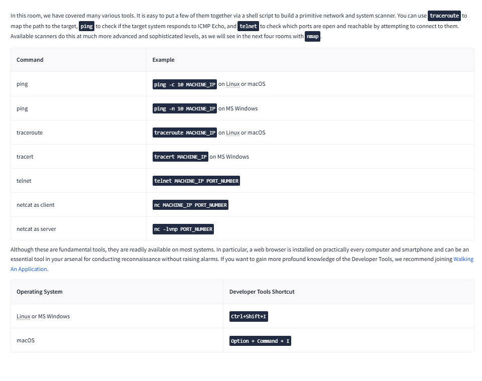

# Lab Report: Active Reconnaissance

## Summary of the Target
This lab demonstrates **active information gathering**, directly interacting with systems to identify live hosts and gather network information.

## Exploitation Steps
1. Used **ping sweeps** to detect live hosts.  
2. Performed **traceroute** to map network paths.  
3. Tested with **telnet** and **HTTP requests** for banners.  

## Findings with Screenshots
- Discovered live IP addresses.  
- Identified network hops and routes.  
- Collected service banners for software versioning.  

## Remediation Advice
- Restrict ICMP and traceroute responses.  
- Disable verbose banners on services.  
- Monitor logs for suspicious scanning activity.  
