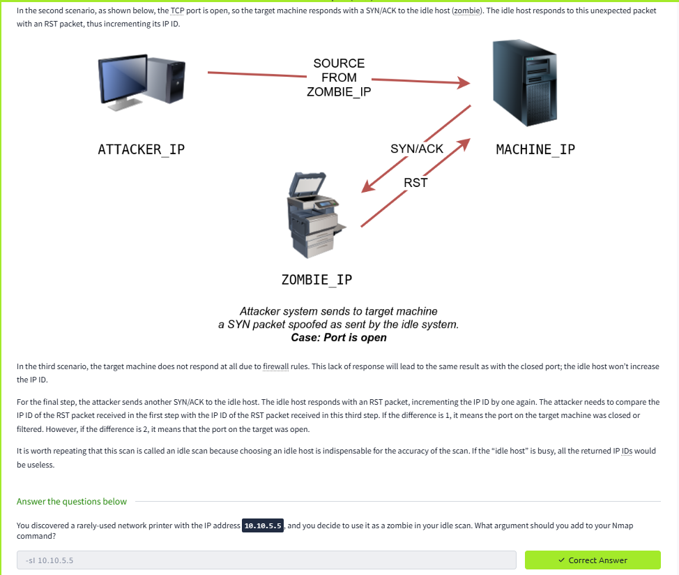

# Lab Report: Nmap Advanced Scans

## Summary of the Target
This lab focuses on **advanced Nmap techniques** like stealth scans, evasion, and firewall bypassing.

## Exploitation Steps
1. Ran **Null, FIN, and Xmas scans** (`-sN`, `-sF`, `-sX`).  
2. Used **Idle scan** (`-sI`) to mask source IP.  
3. Applied **timing and decoy options** to evade detection.  

## Findings with Screenshots
- Detected filtered vs open ports behind firewalls.  
- Bypassed IDS logging using spoofed scans.  
- Validated service availability stealthily.  

## Remediation Advice
- Enable IDS/IPS with stealth scan detection.  
- Use proper firewall rules to drop suspicious traffic.  
- Monitor anomalous traffic patterns closely.  
