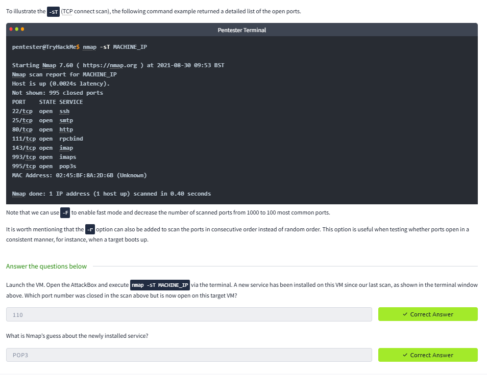

# Lab Report: Nmap Basic Scans

## Summary of the Target
This lab covers **Nmap basic port scanning** methods to enumerate open TCP/UDP ports.

## Exploitation Steps
1. Conducted **TCP connect scan** (`-sT`).  
2. Performed **SYN scan** (`-sS`).  
3. Ran **UDP scan** (`-sU`) for services like DNS and SNMP.  

## Findings with Screenshots
- Open TCP ports discovered.  
- UDP ports responding to queries.  
- Identified potential services for exploitation.  

## Remediation Advice
- Use firewalls to filter unused ports.  
- Limit exposure of UDP-based services.  
- Conduct periodic vulnerability scans.  
