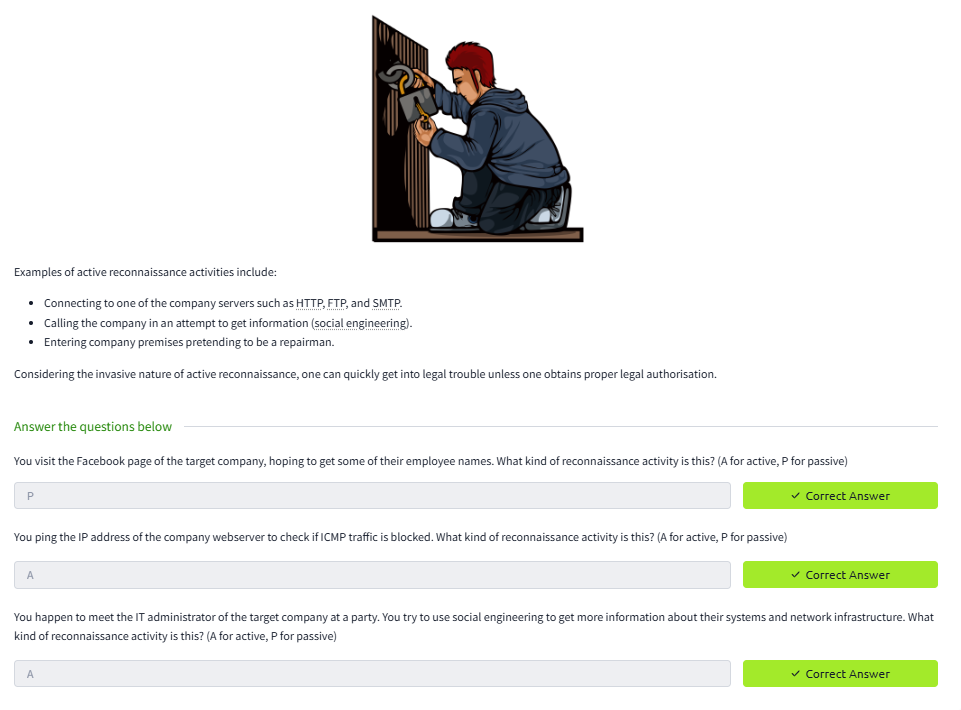

# Lab Report: Passive Reconnaissance

## Summary of the Target
This lab focuses on passive information gathering using tools like whois, nslookup, and dig.

## Exploitation Steps
1. Performed whois lookup to identify domain registration details.  
2. Used nslookup to find DNS records.  
3. Ran dig for advanced DNS queries.

## Findings with Screenshots
- Identified domain registrar and nameservers.  
- Extracted IP ranges and email contacts.  

## Remediation Advice
- Use privacy-protected WHOIS records.  
- Limit public DNS exposure.  
- Monitor domain leaks regularly.
